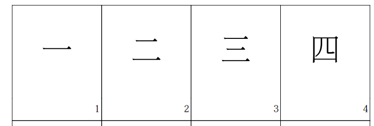

# Remembering Hanzi flashcards.

This repository contains a python script to build a pdf from 1500 characters of Remembering Hanzi textbook.

You can print it and then cut it into pieces to get your flashcards!



## Get your flashcards.

For getting the **Remembering Hanzi flashcards** you just have to print download the next pdf [Remembering Hanzi flashcards](Hanzi%20para%20recordar%20-%20flashcards.pdf)

## Customize your flashcards.

You might want to customize your flashcards for another language or for other purpose. You have to take into account that you need Python3 installed in your computer, otherwise it will not work. You will also need Git if you want to download this repository using Git, but it's not needed.

To create your own flashcards you have to follow the next steps:

**1. Download this repository**.

You can download this repository by clicking on the icon **code** in the top sidebar, and then **Download ZIP**

If you are familiar with developer tools, you can also clone this repository by executing the following command in your terminal.

```sh
git clone https://github.com/hector-medina/remembering-hanzi-flashcards.git
```

**2. Activate virtual environment.**

Once downloaded, you have to open your terminal and go inside the folder you've just downloded:

```sh
cd PATH-TO-FOLDER/remembering-hanzi-flashcards
```
Once here, if you are in MacOS run: 
```sh
source env/bin/activate
```

**3. Override the data.**

Open up the data.py file in an IDE or notebook. This is the data that the program will use to build the flashcards.

Every card is an instance of a class called 'Char'. You just have to replace this data with your own data, but you have to take into account the data structure. To build a new flashcard you have to use the following sintax:

```sh
data = [
  Char('identifier', 'character', 'meaning', 'sound', 'explain'),
  Char('identifier_2', 'character_2', 'meaning_2', 'sound_2', 'explain_2'),
  ...
  ...
  ...
  Char('identifier_m', 'character_n', 'meaning_n', 'sound_n', 'explain_n'),
]
```

- identifier = It's a number that will be shown in the bottom-right front screen of the flashcard. It's just a number used to ordering or looking up flashcards. 
- character = This is the chinese character used in the Remembering Hanzi flashcards, you can change it for something else.
- meaning = This is the meaning of the character.
- sound = This is the pronunciation of the character.
- explain = This is the explanation of the character.

**4. Run the pdf maker script.**

To run the script you have to use the following command:

```sh
python3 pdf.py
```

**5. Print your custom flashcards.**

Hiuhuu!! You're flashcards are ready, waiting for you to print them. You just have to open up the "Hanzi para recordar.pdf" that has been created after running the command in step 4.
